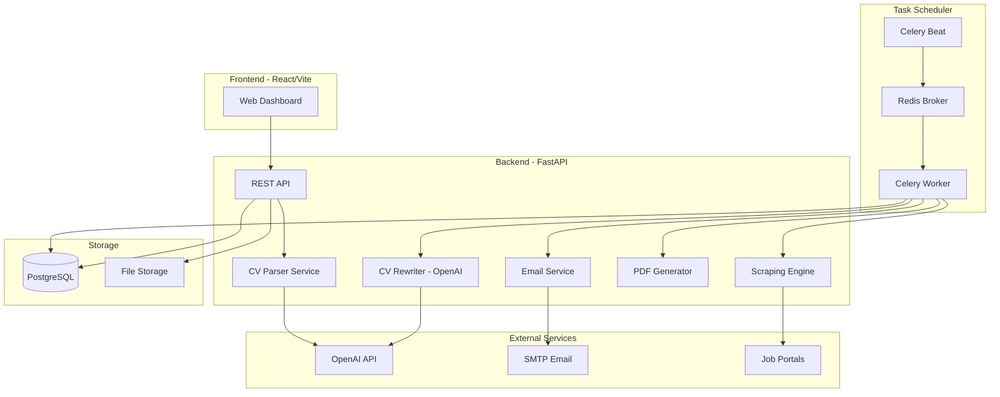
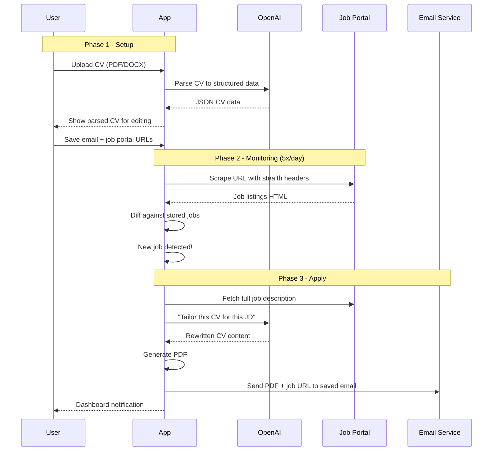
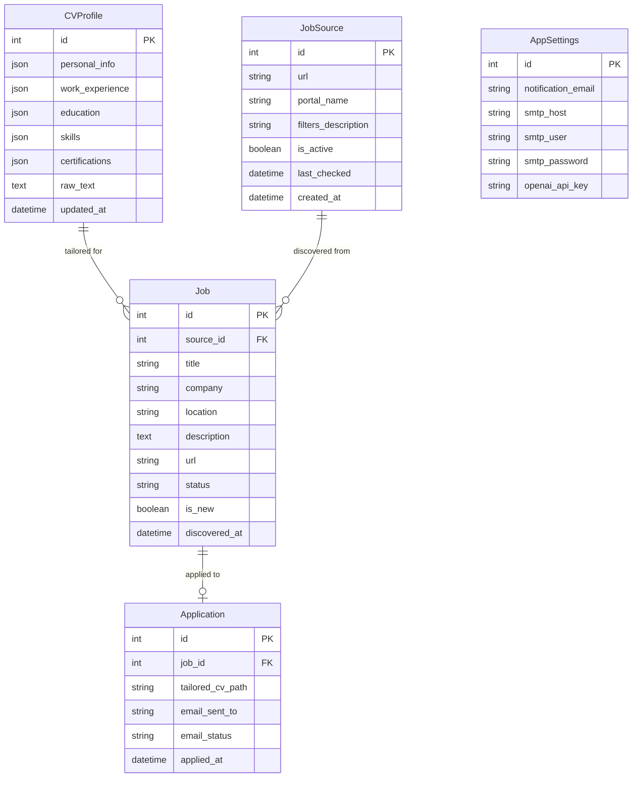

# Auto Job Apply - Micro Web App

## High-Level Architecture




## Data Flow




## Tech Stack

- **Backend**: Python 3.11+ / FastAPI
  - Best ecosystem for LLM integration, web scraping, and PDF generation
  - Async-first, fast, auto-generates API docs
- **Frontend**: React 18 + Vite + Tailwind CSS
  - Lightweight SPA, modern UI, fast dev experience
- **Database**: PostgreSQL (via SQLAlchemy + Alembic migrations)
- **Task Queue**: Celery + Redis (for scheduled scraping, async CV generation)
- **LLM**: OpenAI API (`gpt-4o-mini` for parsing, `gpt-4o` for CV rewriting)
- **Scraping**: `httpx` + `BeautifulSoup4` with stealth headers (lightweight)
  - Fallback: Playwright for JS-rendered portals
- **PDF Generation**: WeasyPrint (HTML/CSS to PDF, professional-looking output)
- **Email**: `smtplib` with Gmail App Password or SendGrid API
- **Deployment**: Docker Compose (FastAPI + React + PostgreSQL + Redis), deploy to Railway / Render / AWS ECS

## Anti-Blocking Strategy for Scraping

Since we only check 5 times/day, the request volume is very low. Additional safeguards:

- **Random delays**: 2-10 second random sleep between requests
- **User-Agent rotation**: Pool of 20+ real browser user-agent strings
- **Request headers**: Full browser-like headers (Accept, Accept-Language, Referer, etc.)
- **Rate limiting**: Built-in per-domain rate limiter (max 1 request/minute per domain)
- **Proxy support**: Optional proxy rotation config for portals that are strict
- **Session management**: Reuse cookies/sessions like a real browser
- **Playwright fallback**: For portals that require JS rendering or have bot detection

## Key Libraries


| Purpose         | Library                                     |
| --------------- | ------------------------------------------- |
| Web framework   | `fastapi`, `uvicorn`                        |
| Database ORM    | `sqlalchemy`, `alembic`, `asyncpg`          |
| Task queue      | `celery`, `redis`                           |
| LLM             | `openai`                                    |
| CV file parsing | `python-docx`, `PyPDF2`, `python-multipart` |
| Web scraping    | `httpx`, `beautifulsoup4`, `playwright`     |
| PDF generation  | `weasyprint`                                |
| Email           | `smtplib` (stdlib), or `sendgrid`           |
| Frontend        | `react`, `vite`, `tailwindcss`, `axios`     |


## Project Structure

```
auto-job-apply/
├── backend/
│   ├── app/
│   │   ├── main.py              # FastAPI app entry
│   │   ├── config.py            # Settings (OpenAI key, SMTP, DB URL)
│   │   ├── database.py          # SQLAlchemy setup
│   │   ├── models/              # DB models
│   │   │   ├── cv.py            # CV data model
│   │   │   ├── job_source.py    # Job portal URL + filters
│   │   │   ├── job.py           # Discovered jobs
│   │   │   └── application.py   # Sent applications log
│   │   ├── routers/
│   │   │   ├── cv.py            # CV upload, parse, CRUD
│   │   │   ├── sources.py       # Job source URL management
│   │   │   ├── jobs.py          # Job listing endpoints
│   │   │   └── settings.py      # Email config, preferences
│   │   ├── services/
│   │   │   ├── cv_parser.py     # OpenAI CV parsing
│   │   │   ├── cv_writer.py     # OpenAI CV rewriting
│   │   │   ├── scraper.py       # Job portal scraper
│   │   │   ├── pdf_generator.py # WeasyPrint PDF output
│   │   │   └── email_sender.py  # Email with attachment
│   │   ├── tasks/
│   │   │   ├── celery_app.py    # Celery config
│   │   │   └── job_monitor.py   # Scheduled scraping task
│   │   └── templates/
│   │       └── cv_template.html # HTML template for PDF CV
│   ├── alembic/                 # DB migrations
│   ├── requirements.txt
│   └── Dockerfile
├── frontend/
│   ├── src/
│   │   ├── pages/
│   │   │   ├── Dashboard.tsx    # Overview, recent jobs, stats
│   │   │   ├── CVEditor.tsx     # Upload + edit CV data
│   │   │   ├── Sources.tsx      # Manage job portal URLs
│   │   │   ├── Jobs.tsx         # View discovered jobs + status
│   │   │   └── Settings.tsx     # Email, API keys, preferences
│   │   ├── components/
│   │   └── App.tsx
│   ├── package.json
│   └── Dockerfile
├── docker-compose.yml
└── README.md
```

## Database Schema




---

## Design System

### Philosophy

Minimal & Light -- inspired by Notion and Stripe. The app should feel calm, functional, and professional. No visual clutter. Every element earns its place.

### Color Palette


| Token                   | Value     | Usage                                 |
| ----------------------- | --------- | ------------------------------------- |
| `--color-bg`            | `#FFFFFF` | Page background                       |
| `--color-surface`       | `#F9FAFB` | Cards, panels, input backgrounds      |
| `--color-border`        | `#E5E7EB` | Borders, dividers                     |
| `--color-text`          | `#111827` | Primary text                          |
| `--color-text-muted`    | `#6B7280` | Secondary/helper text                 |
| `--color-primary`       | `#2563EB` | Primary actions, links, active states |
| `--color-primary-hover` | `#1D4ED8` | Hover state for primary               |
| `--color-success`       | `#16A34A` | Success badges, sent status           |
| `--color-warning`       | `#D97706` | Warnings, pending states              |
| `--color-danger`        | `#DC2626` | Errors, destructive actions           |


### Typography

- **Font Family**: `Inter` (fallback: `-apple-system, BlinkMacSystemFont, Segoe UI, sans-serif`)
- **Scale**: 12px / 14px / 16px / 20px / 24px / 32px
- **Font weights**: 400 (body), 500 (labels/nav), 600 (headings), 700 (page titles)
- **Line height**: 1.5 for body, 1.25 for headings

### Spacing

- **Base unit**: 4px
- **Scale**: 4 / 8 / 12 / 16 / 24 / 32 / 48 / 64px
- **Card padding**: 24px
- **Page padding**: 32px horizontal, 24px vertical
- **Gap between sections**: 32px

### Layout

- **Desktop**: Fixed left sidebar (240px) + scrollable content area
- **Responsive**: Sidebar collapses to top hamburger menu below 768px
- **Max content width**: 960px (centered in content area)
- **Grid**: CSS Grid / Flexbox, no fixed column system

### Component Patterns


| Component    | Style                                                              |
| ------------ | ------------------------------------------------------------------ |
| Buttons      | Rounded-md (6px), 36px height, filled primary / outlined secondary |
| Inputs       | 40px height, 1px border, 8px radius, focus ring `--color-primary`  |
| Cards        | White bg, 1px border, 8px radius, subtle shadow (`0 1px 3px` rgba) |
| Tables       | No outer border, horizontal dividers only, hover row highlight     |
| Badges       | Pill shape, small text (12px), color-coded by status               |
| Modals       | Centered overlay, 480px max-width, backdrop blur                   |
| Toast/Alerts | Bottom-right, auto-dismiss (5s), icon + message                    |
| Empty states | Centered illustration/icon + helper text + CTA button              |
| Loading      | Skeleton placeholders (not spinners) for content areas             |


### Iconography

- **Library**: Lucide React (consistent, lightweight, MIT licensed)
- **Size**: 16px inline, 20px in nav, 24px in empty states
- **Style**: Outline only, 1.5px stroke

### Interaction Principles

- No page reloads -- SPA with client-side routing
- Optimistic UI where possible (show change, revert on error)
- Skeleton loading for all data-fetched views
- Subtle transitions (150ms ease) on hover/focus states
- Confirmation dialog for destructive actions only (delete source, clear CV)

---

## Product Functionality

### User Model

- **Single user, no authentication**. The app runs locally or on a private server.
- All data belongs to one user. No multi-tenancy, no login screen.
- App starts at Dashboard on launch.

### Screen-by-Screen Functionality

#### 1. Dashboard (`/`)

**Purpose**: At-a-glance status of the entire system.


| Element           | Detail                                                                             |
| ----------------- | ---------------------------------------------------------------------------------- |
| Stats bar         | Cards showing: Active Sources count, New Jobs (24h), CVs Sent (7d), Last Scan time |
| Recent jobs table | Last 10 discovered jobs: Title, Company, Source, Discovered date, Status badge     |
| Quick actions     | "Add Source" button, "Upload CV" button (if no CV exists)                          |
| System status     | Celery worker status indicator (green/red dot), next scheduled scan time           |


**Edge cases**:

- First launch (no CV, no sources): Show onboarding empty state with guided steps
- Celery not running: Show warning banner with troubleshooting link

#### 2. CV Editor (`/cv`)

**Purpose**: Upload, parse, view, and edit your CV data.


| Element           | Detail                                                                                        |
| ----------------- | --------------------------------------------------------------------------------------------- |
| Upload zone       | Drag-and-drop or click to upload PDF/DOCX (max 5MB)                                           |
| Parsing status    | Show progress while OpenAI parses (skeleton + status text)                                    |
| Structured editor | Editable sections: Personal Info, Summary, Work Experience, Education, Skills, Certifications |
| Work Experience   | Each entry: Title, Company, Duration, bullet-point achievements (add/remove/reorder)          |
| Skills            | Tag-style input, add/remove individual skills                                                 |
| Save button       | Saves to DB, shows success toast                                                              |
| Preview button    | Opens PDF preview of current CV data in ATS template                                          |


**ATS Template Rules**:

- Single column, no tables, no graphics, no headers/footers
- Section headings in bold, clear hierarchy
- Standard fonts only (in PDF output)
- Keywords preserved exactly as entered

**Edge cases**:

- Re-upload CV: Confirm overwrite of existing parsed data
- Parse failure: Show error with option to manually enter data
- Empty sections: Allow saving with optional sections empty

#### 3. Job Sources (`/sources`)

**Purpose**: Manage the URLs the system monitors for new job listings.


| Element            | Detail                                                                            |
| ------------------ | --------------------------------------------------------------------------------- |
| Add source form    | URL input + portal name (free text label) + optional filters description          |
| Sources table      | URL, Portal Name, Status (Active/Paused), Last Checked, Jobs Found count, Actions |
| Actions per source | Pause/Resume toggle, Edit, Delete, "Scan Now" manual trigger                      |
| Validation         | On add: HTTP HEAD check to verify URL is reachable                                |


**Scope**: Custom URLs only (career pages, job board search result pages). No portal-specific login/auth handling.

**Edge cases**:

- URL unreachable: Show warning but allow saving (site might be temporarily down)
- Duplicate URL: Prevent with validation message
- Source with found jobs: Confirm before delete (jobs remain in DB but source link removed)

#### 4. Jobs (`/jobs`)

**Purpose**: View all discovered jobs and their application status.


| Element          | Detail                                                                                |
| ---------------- | ------------------------------------------------------------------------------------- |
| Filter bar       | By source, by status (New / Viewed / CV Sent / Skipped), date range                   |
| Jobs table       | Title, Company, Location, Source, Discovered date, Status badge, Actions              |
| Job detail panel | Click row to expand: full job description, matched skills highlight, tailored CV link |
| Actions per job  | "Generate CV" (manual trigger), "Mark as Skipped", "View Tailored CV" (PDF download)  |
| Bulk actions     | Select multiple + "Skip Selected"                                                     |


**Status flow**: `New` -> `Viewed` (on click) -> `CV Sent` (after email) or `Skipped` (manual)

**Edge cases**:

- Job description fetch fails: Show partial data with "Could not fetch description" note
- Duplicate jobs across sources: Deduplicate by URL
- Very long descriptions: Truncate with "Show more" in detail panel

#### 5. Settings (`/settings`)

**Purpose**: Configure email, API keys, and scan preferences.


| Section              | Fields                                                                                                        |
| -------------------- | ------------------------------------------------------------------------------------------------------------- |
| Email Notification   | Notification email address, SMTP host, SMTP port, SMTP user, SMTP password (masked), "Send Test Email" button |
| OpenAI Configuration | API key (masked), model selection dropdown (gpt-4o-mini / gpt-4o)                                             |
| Scan Preferences     | Scan frequency (dropdown: 3x/day, 5x/day, 8x/day), time window (e.g., 8AM-8PM only)                           |
| Data Management      | "Export All Data" (JSON), "Clear All Jobs", "Reset CV"                                                        |


**Edge cases**:

- Invalid SMTP config: Test email button shows specific error
- Invalid OpenAI key: Validate on save with a test API call
- Destructive actions: Confirmation modal with typed confirmation for "Clear All Jobs" and "Reset CV"

### User Flows

#### Flow 1: First-Time Setup

1. User opens app -> Dashboard shows onboarding empty state
2. User clicks "Upload CV" -> Navigates to CV Editor
3. User uploads PDF -> OpenAI parses -> User reviews and edits -> Saves
4. User navigates to Sources -> Adds first job portal URL
5. User navigates to Settings -> Configures email + OpenAI key
6. System begins monitoring automatically on next scheduled scan

#### Flow 2: Daily Usage (Passive)

1. Celery Beat triggers scan (5x/day by default)
2. Scraper checks all active sources
3. New jobs detected -> Stored in DB with status "New"
4. For each new job: Fetch full description -> Tailor CV via OpenAI -> Generate PDF
5. Email notification sent to user with PDF attachment + job link
6. User checks email, reviews CV, applies manually on portal

#### Flow 3: Manual Intervention

1. User opens Dashboard -> Sees new jobs
2. Clicks into Jobs page -> Reviews job detail
3. Decides to skip some jobs (marks as "Skipped")
4. For interesting ones: Clicks "Generate CV" to re-trigger tailoring
5. Downloads PDF and applies manually

### Scope Boundaries


| In Scope                              | Out of Scope                             |
| ------------------------------------- | ---------------------------------------- |
| Custom URL scraping (career pages)    | Portal login/auth (LinkedIn login, etc.) |
| Generic HTML parsing for job listings | Portal-specific APIs                     |
| OpenAI CV tailoring                   | Auto-filling application forms           |
| Email notification to self            | Direct application submission to portals |
| ATS-friendly PDF generation           | Multiple CV template designs             |
| Single-user local/private deployment  | Multi-user, auth, billing                |
| Manual scan trigger                   | Real-time websocket job notifications    |
| Basic job deduplication               | ML-based job relevance scoring           |


---

## Milestones

### Milestone 1: Project Scaffolding and CV Management

- Set up FastAPI backend, React frontend, PostgreSQL, Docker Compose
- Implement CV upload endpoint (PDF/DOCX)
- Integrate OpenAI to parse CV into structured JSON
- Build CV editor page (view, edit, save parsed data)
- Files: `backend/app/main.py`, `backend/app/services/cv_parser.py`, `frontend/src/pages/CVEditor.tsx`

### Milestone 2: Job Source Management and Scraping Engine

- Build CRUD API for job portal URLs
- Implement generic scraper with stealth headers (`httpx` + `BeautifulSoup4`)
- Add anti-detection: user-agent rotation, random delays, rate limiting
- Add Playwright fallback for JS-heavy portals
- Build Sources management page in frontend
- Files: `backend/app/services/scraper.py`, `backend/app/routers/sources.py`, `frontend/src/pages/Sources.tsx`

### Milestone 3: Scheduled Job Monitoring and New Job Detection

- Set up Celery + Redis with Celery Beat (5x/day schedule)
- Implement job diffing logic (hash-based deduplication against stored jobs)
- Store new jobs in DB, extract full job descriptions
- Build Jobs listing page with status indicators
- Files: `backend/app/tasks/job_monitor.py`, `backend/app/tasks/celery_app.py`, `frontend/src/pages/Jobs.tsx`

### Milestone 4: AI-Powered CV Tailoring and PDF Generation

- Build OpenAI prompt chain: CV data + Job Description -> tailored CV content
- Design professional HTML/CSS CV template
- Implement WeasyPrint PDF generation from tailored content
- Add download endpoint for generated PDFs
- Files: `backend/app/services/cv_writer.py`, `backend/app/services/pdf_generator.py`, `backend/app/templates/cv_template.html`

### Milestone 5: Email Notification System

- Implement SMTP email service with PDF attachment support
- Build settings page for email configuration
- Wire email sending into the Celery task pipeline (after PDF generation)
- Add application logging (track what was sent, when, to whom)
- Files: `backend/app/services/email_sender.py`, `backend/app/routers/settings.py`, `frontend/src/pages/Settings.tsx`

### Milestone 6: Dashboard, Polish, and Cloud Deployment

- Build dashboard with stats (jobs found, CVs sent, sources active)
- Add error handling, retry logic, and logging throughout
- Finalize Docker Compose for production
- Deploy to cloud (Railway / Render / AWS)
- Write README with setup instructions
- Files: `docker-compose.yml`, `frontend/src/pages/Dashboard.tsx`, `README.md`

